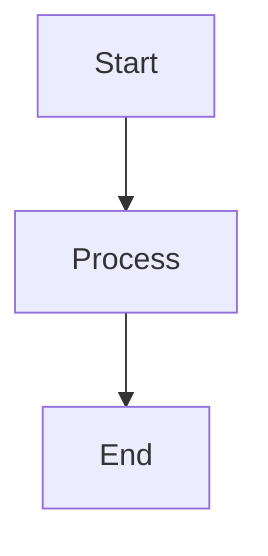

# Documentation Website Setup

This folder contains the Docsify-powered documentation website for Ëtrid Protocol's Exchange Expansion system.

## Features

- **Beautiful UI**: Clean, responsive design with Vue theme
- **Full-Text Search**: Search across all documentation
- **Syntax Highlighting**: Code blocks with language support
- **Copy to Clipboard**: One-click code copying
- **Navigation**: Sidebar, navbar, and pagination
- **Markdown Extensions**: Tabs, alerts, diagrams (Mermaid)
- **No Build Required**: Pure HTML/JS, no compilation needed

## Running Locally

### Option 1: Docsify CLI (Recommended)

```bash
# Install docsify-cli globally
npm install -g docsify-cli

# Run from docs folder
cd docs
docsify serve

# Open browser
# Visit: http://localhost:3000
```

### Option 2: Python HTTP Server

```bash
# From docs folder
cd docs
python3 -m http.server 3000

# Visit: http://localhost:3000
```

### Option 3: Node HTTP Server

```bash
# Install http-server globally
npm install -g http-server

# Run from docs folder
cd docs
http-server -p 3000

# Visit: http://localhost:3000
```

### Option 4: Live Server (VS Code)

1. Install "Live Server" extension in VS Code
2. Open `docs/index.html`
3. Right-click → "Open with Live Server"

## Deployment

### Option 1: GitHub Pages

```bash
# 1. Push docs folder to GitHub
git add docs/
git commit -m "Add documentation site"
git push

# 2. Enable GitHub Pages
# Go to: Repository → Settings → Pages
# Source: Branch main, folder /docs
# Save

# Visit: https://yourusername.github.io/etrid-protocol/
```

### Option 2: Netlify

```bash
# 1. Create netlify.toml in project root
[build]
  publish = "docs"

# 2. Connect repository to Netlify
# 3. Deploy automatically on push
```

### Option 3: Vercel

```bash
# 1. Create vercel.json in project root
{
  "buildCommand": "",
  "outputDirectory": "docs",
  "framework": null
}

# 2. Import project in Vercel
# 3. Deploy
```

### Option 4: Static Host (Nginx/Apache)

```bash
# Copy docs folder to web server
scp -r docs/* user@server:/var/www/html/docs/

# Configure web server to serve static files
# No special configuration needed
```

## Customization

### Colors & Theme

Edit `docs/index.html`:

```css
:root {
  --theme-color: #3b82f6;  /* Primary color */
  --theme-color-dark: #2563eb;  /* Dark variant */
  --sidebar-width: 280px;  /* Sidebar width */
}
```

### Navigation

- **Sidebar**: Edit `docs/_sidebar.md`
- **Navbar**: Edit `docs/_navbar.md`
- **Cover Page**: Edit `docs/_coverpage.md`

### Homepage

Edit `docs/home.md` for the main landing page.

### Adding Pages

1. Create markdown file in `docs/` (e.g., `my-guide.md`)
2. Add link to `docs/_sidebar.md`:

```markdown
* My Section
  * [My Guide](my-guide.md)
```

3. File will be automatically indexed and searchable

### Plugins

Available plugins (already included):

- `docsify-copy-code` - Copy code blocks
- `docsify-pagination` - Next/Previous buttons
- `docsify-tabs` - Tabbed content
- `docsify-mermaid` - Diagrams
- `flexible-alerts` - Callout boxes

To add more plugins, see: https://docsify.js.org/#/plugins

## Features

### Search

Full-text search across all markdown files. Index updates automatically.

### Code Highlighting

Supported languages (auto-detected):
- Bash/Shell
- TypeScript/JavaScript
- Solidity
- JSON
- YAML
- And many more...

### Diagrams

Create diagrams with Mermaid:

````markdown

````

### Alerts

Create callout boxes:

```markdown
> [!NOTE]
> This is a note

> [!TIP]
> This is a tip

> [!WARNING]
> This is a warning

> [!DANGER]
> This is dangerous
```

### Tabs

Create tabbed content:

```markdown
<!-- tabs:start -->

#### **Tab 1**

Content for tab 1

#### **Tab 2**

Content for tab 2

<!-- tabs:end -->
```

## File Structure

```
docs/
├── index.html          # Main HTML file (Docsify config)
├── home.md             # Homepage content
├── _sidebar.md         # Sidebar navigation
├── _navbar.md          # Top navbar
├── _coverpage.md       # Cover page
├── DOCS_SETUP.md       # This file
├── _media/             # Images, logos, etc.
│   └── logo.svg
└── *.md                # Additional markdown files
```

## Linking to External Files

To link to markdown files outside the docs folder:

```markdown
[BSC Deployment Guide](../05-multichain/bridge/adapters/bsc/README_DEPLOYMENT.md)
```

Docsify will automatically render them.

## Tips

### SEO

Add meta tags to `index.html`:

```html
<meta name="description" content="Ëtrid Protocol Documentation">
<meta name="keywords" content="blockchain, defi, ethereum, bsc">
```

### Google Analytics

Add to `index.html` in `<head>`:

```html
<script async src="https://www.googletagmanager.com/gtag/js?id=GA_MEASUREMENT_ID"></script>
<script>
  window.dataLayer = window.dataLayer || [];
  function gtag(){dataLayer.push(arguments);}
  gtag('js', new Date());
  gtag('config', 'GA_MEASUREMENT_ID');
</script>
```

### Custom Domain

For GitHub Pages:

1. Add `CNAME` file to `docs/` with your domain
2. Configure DNS:
   - Type: A
   - Name: @
   - Value: 185.199.108.153 (GitHub Pages IP)

### Performance

Docsify is fast by default (no build step), but you can:

- Enable CDN caching
- Use lazy loading for images
- Minimize custom CSS

## Troubleshooting

### 404 on Links

- Ensure markdown files exist at the specified path
- Use relative paths from `docs/` folder
- Check case sensitivity (file.md vs File.md)

### Search Not Working

- Clear browser cache
- Check JavaScript console for errors
- Ensure `search.min.js` plugin is loaded

### Plugins Not Loading

- Check internet connection (CDN-hosted plugins)
- Verify plugin script tags in `index.html`
- Check JavaScript console for errors

### Styles Not Applying

- Clear browser cache
- Check CSS syntax in `<style>` tags
- Inspect element to see which styles are applied

## Resources

- **Docsify Documentation**: https://docsify.js.org
- **Markdown Guide**: https://www.markdownguide.org
- **Mermaid Diagrams**: https://mermaid-js.github.io
- **Emoji Cheat Sheet**: https://www.webfx.com/tools/emoji-cheat-sheet/

## License

MIT

---

**Need help?** Open an issue on GitHub or ask in Discord!
