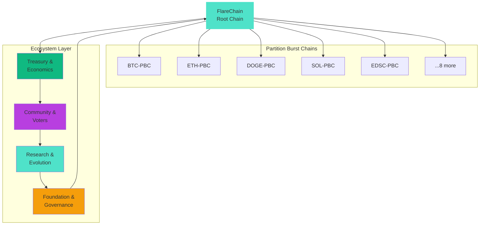

# Ëtrid Visual Assets - Complete Specifications

**Date**: October 24, 2025
**Purpose**: Master specifications for all visual assets
**For**: GizziClaude to implement in Figma/Canva

---

## 🗺️ Asset Priority List

### High Priority (Create First)
1. ✅ Ëtrid Logo (already exists)
2. ✅ Consensus Logo (spec complete)
3. 🔴 **Ecosystem Map Diagram**
4. 🔴 **E³20 Component Stack Visual**
5. 🔴 **Consensus Day 4-Phase Cycle**

### Medium Priority (Week 2)
6. Token Economy Flow
7. ASF Finality Progression
8. Multichain Architecture (FlareChain + PBCs)

### Lower Priority (Month 2)
9. Explorer Dashboard Mockup
10. Governance UI Components
11. Social Media Templates

---

## 1️⃣ ECOSYSTEM MAP DIAGRAM

### Concept: Circular Node Network

**Description**: Shows how all Ëtrid ecosystem layers interconnect

**Visual Style**: Sankey/Flow diagram with circular arrangement

**Canvas Size**: 1920x1080px (16:9 landscape)

**Background**: Deep Space Blue gradient to Base Black
```css
background: radial-gradient(circle at center, #0A1929 0%, #000000 100%);
```

---

### Layout Structure

```
                    🏛️ Foundation
                        ↑ ↓

    🧬 Research   ←→   FlareChain   ←→   💰 Treasury
    (ERA + ËPS)        (CENTER)          (Fiscal)
                        ↑ ↓

                    13 PBCs Layer
                    (Ring around)
```

---

### Layer Breakdown

#### Center: FlareChain (Root Chain)
**Position**: Center of canvas (960, 540)
**Shape**: Large circle (200px diameter)
**Color**: Tech Green-Blue (#4FE2C9) with glow
**Label**: "FlareChain" (Inter Semi-Bold, 24px)
**Icon**: Ëtrid logo symbol

#### Ring 1: 13 Partition Burst Chains
**Position**: Circular array around FlareChain (radius: 350px)
**Shape**: 13 smaller circles (80px diameter each)
**Colors**: Gradient from purple to cyan (varies per PBC)
**Labels**: BTC, ETH, DOGE, SOL, XLM, XRP, BNB, TRX, ADA, LINK, MATIC, USDT, EDSC
**Connection Lines**: Thin lines (#475569, 2px) connecting to FlareChain

#### Ring 2: Ecosystem Components
**Position**: Outer ring (radius: 600px)
**Components**: 4 major nodes at cardinal points

**North (Top)**: Foundation & Governance
- Icon: 🏛️ (building/governance)
- Label: "Foundation & Governance"
- Color: Gold accent (#F59E0B)

**East (Right)**: Treasury & Economics
- Icon: 💰 (vault/treasury)
- Label: "Treasury & Economics"
- Color: Green accent (#10B981)

**South (Bottom)**: Community & Voters
- Icon: 👥 (people)
- Label: "Community & Voters"
- Color: Purple accent (#B83FE0)

**West (Left)**: Research & Evolution
- Icon: 🔬 (research)
- Label: "Research & Evolution (ERA + ËPS)"
- Color: Cyan accent (#4FE2C9)

---

### Connection Flows (Animated Arrows)

#### Flow 1: Computation → Treasury
```
PBCs → VMw (energy) → ÉTR (fees) → Treasury
```
**Arrow Color**: Gradient from cyan to green
**Style**: Flowing particles/dots animation

#### Flow 2: Treasury → Distribution
```
Treasury → Consensus Day → Validators/Voters/Directors
```
**Arrow Color**: Gradient from green to purple
**Style**: Pulse/wave animation

#### Flow 3: Governance → Protocol
```
Research (ERA) → Proposals (ËPS) → Consensus Day → FlareChain Upgrade
```
**Arrow Color**: Gradient from gold to cyan
**Style**: Circular loop animation

---

### Figma Implementation Guide

**Step 1**: Create Canvas
```
Width: 1920px
Height: 1080px
Background: Radial gradient (#0A1929 → #000000)
```

**Step 2**: Center Node (FlareChain)
```
Circle:
  - Diameter: 200px
  - Position: (960, 540)
  - Fill: #4FE2C9
  - Effect: Drop Shadow (blur 32px, spread 16px, color #4FE2C9 50%)
  - Icon: Paste Ëtrid logo symbol
  - Label: "FlareChain" (Inter Semi-Bold, 24px, #F8FAFC)
```

**Step 3**: PBC Ring (13 nodes)
```
For each PBC (i = 0 to 12):
  angle = (360 / 13) * i
  x = 960 + 350 * cos(angle)
  y = 540 + 350 * sin(angle)

  Circle:
    - Diameter: 80px
    - Position: (x, y)
    - Fill: Gradient (#B83FE0 → #4FE2C9) rotated by angle
    - Effect: Glow (blur 16px)
    - Label: PBC name (Inter Medium, 14px)

  Line (connecting to center):
    - Start: (x, y)
    - End: (960, 540)
    - Stroke: #475569, 2px, 50% opacity
```

**Step 4**: Outer Nodes (4 cardinal points)
```
Foundation (Top):
  - Position: (960, 100)
  - Circle: 120px diameter, #F59E0B fill
  - Icon: Building emoji or custom SVG

Treasury (Right):
  - Position: (1500, 540)
  - Circle: 120px diameter, #10B981 fill

Community (Bottom):
  - Position: (960, 980)
  - Circle: 120px diameter, #B83FE0 fill

Research (Left):
  - Position: (420, 540)
  - Circle: 120px diameter, #4FE2C9 fill
```

**Step 5**: Flow Arrows
```
Use Pen tool to draw curved arrows
Style: Dashed or dotted
Colors: Gradients matching flow direction
Add arrowheads at endpoints
```

---

### Canva Alternative

1. Use "Elements" → "Lines & Shapes" → Circle
2. Arrange in circular pattern manually
3. Add text labels
4. Use "Effects" → "Shadow" for glow
5. Draw arrows with "Lines" → "Arrow"

---

### Mermaid Code (For Quick Preview)



---

## 2️⃣ E³20 COMPONENT STACK VISUAL

### Concept: Layered Architecture Diagram

**Canvas Size**: 1200x1600px (portrait)

**Visual Style**: Stacked horizontal layers with connections

---

### Layer Structure (Bottom to Top)

```
┌─────────────────────────────────────┐
│  13. Clients (CLI, Web, SDKs)       │ ← Top Layer
├─────────────────────────────────────┤
│  12. Consensus Day                   │
├─────────────────────────────────────┤
│  11. Peer Roles & Staking            │
├─────────────────────────────────────┤
│  10. Foundation Governance           │
├─────────────────────────────────────┤
│  09. Consensus (ASF)                 │
├─────────────────────────────────────┤
│  08. ËtwasmVM                        │
├─────────────────────────────────────┤
│  07. Transactions                    │
├─────────────────────────────────────┤
│  06. Native Currency (ÉTR/EDSC/VMw)  │
├─────────────────────────────────────┤
│  05. Multichain (FlareChain + PBCs)  │
├─────────────────────────────────────┤
│  04. Accounts & Security             │
├─────────────────────────────────────┤
│  03. Security (Post-Quantum)         │
├─────────────────────────────────────┤
│  02. OpenDID + AIDID                 │
├─────────────────────────────────────┤
│  01. DETR P2P (Lightning-Bloc)       │ ← Base Layer
└─────────────────────────────────────┘
```

---

### Figma Implementation

**Step 1**: Create 13 rectangles
```
For each layer (i = 1 to 13):
  Rectangle:
    - Width: 1000px
    - Height: 100px
    - X: 100
    - Y: 100 + (i-1) * 110
    - Fill: Gradient (#0A1929 → #1E3A5F)
    - Border: 2px solid #4FE2C9
    - Corner Radius: 8px
```

**Step 2**: Add labels
```
Text:
  - Font: Inter Semi-Bold
  - Size: 20px
  - Color: #F8FAFC
  - Position: Centered in rectangle
  - Format: "XX. Component Name"
```

**Step 3**: Add status badges
```
For each layer, add small badge:
  - Shape: Rounded rectangle (8px radius)
  - Text: "✅ 100% Complete"
  - Fill: #10B981
  - Position: Right side of rectangle
```

**Step 4**: Add connection lines
```
Draw vertical line on right side connecting all layers
Style: Dashed, 3px, #475569
Add small circles at each connection point
```

---

### Color Coding by Layer Type

**Infrastructure (Layers 1-3)**: Deep blue gradient
**Core Protocol (Layers 4-9)**: Purple-cyan gradient
**Governance (Layers 10-12)**: Gold-purple gradient
**Client Layer (Layer 13)**: Cyan-green gradient

---

## 3️⃣ CONSENSUS DAY 4-PHASE CYCLE

### Concept: Circular Timeline with 4 Quadrants

**Canvas Size**: 1000x1000px (square)

**Visual Style**: Circular clock with 4 colored segments

---

### Layout

```
           ⬆️ Registration
           (Phase 1)
              |
   ←━━━━━━━━━━┼━━━━━━━━━━→
  Distribution|      Voting
  (Phase 4)   |    (Phase 2)
              |
              ↓
          Minting
         (Phase 3)
```

---

### Phase Specifications

#### Phase 1: Registration (Top - 0° to 90°)
**Color**: Purple (#B83FE0)
**Icon**: 📝 (document/form)
**Duration Label**: "6 hours"
**Description**: "Register proposals & stake"

#### Phase 2: Voting (Right - 90° to 180°)
**Color**: Blue (#3B82F6)
**Icon**: 🗳️ (ballot box)
**Duration Label**: "12 hours"
**Description**: "Cast votes & validator signals"

#### Phase 3: Minting (Bottom - 180° to 270°)
**Color**: Green (#10B981)
**Icon**: 💰 (money/mint)
**Duration Label**: "3 hours"
**Description**: "Execute mint authorization"

#### Phase 4: Distribution (Left - 270° to 360°)
**Color**: Cyan (#4FE2C9)
**Icon**: 📤 (distribution/send)
**Duration Label**: "1 hour"
**Description**: "Distribute to roles"

---

### Figma Implementation

**Step 1**: Create circular segments
```
Use Pen tool to draw 4 arc segments:
- Start angle: 0° (top)
- Each segment: 90° arc
- Radius: 400px (outer), 200px (inner)
- Gap between segments: 10px
```

**Step 2**: Apply colors
```
Phase 1: Fill #B83FE0, Glow effect
Phase 2: Fill #3B82F6, Glow effect
Phase 3: Fill #10B981, Glow effect
Phase 4: Fill #4FE2C9, Glow effect
```

**Step 3**: Center circle
```
Circle:
  - Diameter: 200px
  - Position: (500, 500)
  - Fill: Gradient (#0A1929 → #000000)
  - Label: "CONSENSUS\nDAY" (Inter Bold, 36px)
```

**Step 4**: Add phase labels
```
For each phase:
  - Icon (emoji or SVG): 48px size
  - Phase name: Inter Semi-Bold, 24px
  - Duration: Inter Regular, 16px, 70% opacity
  - Description: Inter Regular, 14px, 60% opacity
  - Position: Center of arc segment
```

**Step 5**: Add arrows
```
Draw circular arrow around outer edge:
  - Clockwise direction
  - Color: White with 50% opacity
  - Dashed style
  - Arrowhead at end
```

---

### Alternative: Linear Timeline

```
Registration → Voting → Minting → Distribution
    (6h)        (12h)     (3h)         (1h)
─────────────────────────────────────────────
0h          6h        18h        21h       22h
```

**Implementation**: Horizontal bar divided into 4 colored sections

---

## 4️⃣ TOKEN ECONOMY FLOW

### Concept: Circular Flow Diagram

**Canvas Size**: 1400x1000px (landscape)

**Visual Style**: Circular flow with 6 stages

---

### Flow Stages

```
1. Computation (PBCs + ËtwasmVM)
        ↓
2. VMw (Energy Measurement)
        ↓
3. ÉTR Fees (Treasury Inflow)
        ↓
4. Consensus Day (Governance Decision)
        ↓
5. Distribution (To Roles)
        ↓
6. Participation (Validators/Voters)
        ↓
    (loops back to 1)
```

---

### Figma Implementation

**Create 6 cards** arranged in circle:

```
Card dimensions: 200px × 150px
Corner radius: 12px
Border: 2px solid gradient
Shadow: 0 8px 16px rgba(0,0,0,0.3)

Card 1 (Computation):
  - Icon: ⚙️ (gear)
  - Color: #B83FE0
  - Label: "Computation"
  - Sublabel: "PBCs + ËtwasmVM"

Card 2 (VMw):
  - Icon: ⚡ (energy)
  - Color: #F59E0B
  - Label: "VMw"
  - Sublabel: "Energy Metering"

Card 3 (Fees):
  - Icon: 💵 (money)
  - Color: #10B981
  - Label: "ÉTR Fees"
  - Sublabel: "Treasury Inflow"

Card 4 (Governance):
  - Icon: 🗳️ (ballot)
  - Color: #3B82F6
  - Label: "Consensus Day"
  - Sublabel: "Governance Decision"

Card 5 (Distribution):
  - Icon: 📤 (distribution)
  - Color: #4FE2C9
  - Label: "Distribution"
  - Sublabel: "To All Roles"

Card 6 (Participation):
  - Icon: 👥 (people)
  - Color: #8B5CF6
  - Label: "Participation"
  - Sublabel: "Validators & Voters"
```

**Connect with curved arrows**:
- Style: Thick (4px), gradient fill
- Arrowheads: 20px
- Animation suggestion: Flowing particles

---

## 5️⃣ ASF FINALITY PROGRESSION

### Concept: Ascending Scale Visualization

**Canvas Size**: 1200x800px (landscape)

**Visual Style**: Rising staircase or mountain

---

### Layout

```
Finality
100% ─────────────────────────── ⬤ (Peak)
                              ⬤
                         ⬤
                    ⬤
75%            ⬤
          ⬤
50%   ⬤
    ⬤
0% ⬤
   │
   └──────────────────────────────────→
   0s   10s   30s   60s   100s   Time
```

---

### Figma Implementation

**Step 1**: Draw axes
```
X-axis: Time (0s to 100s)
Y-axis: Finality % (0% to 100%)
Grid lines: Every 25% (horizontal), every 20s (vertical)
Color: #475569, 1px, 30% opacity
```

**Step 2**: Plot curve
```
Use Pen tool to draw smooth curve:
- Start: (0, 0)
- Control points creating S-curve shape
- End: (100s, 100%)
- Stroke: 4px, gradient (#B83FE0 → #4FE2C9)
- Shadow: Glow effect
```

**Step 3**: Add data points
```
For key timestamps (10s, 30s, 60s, 100s):
  - Circle: 16px diameter
  - Fill: Gradient matching curve
  - Label: Finality % at that point
  - Sublabel: "X validators confirmed"
```

**Step 4**: Add zones
```
Three colored zones:
- Low Finality (0-50%): Red tint, 20% opacity
- Medium Finality (50-90%): Yellow tint, 20% opacity
- High Finality (90-100%): Green tint, 20% opacity
```

---

## 6️⃣ MULTICHAIN ARCHITECTURE

### Concept: Hub-and-Spoke Diagram

**Canvas Size**: 1600x1200px (landscape)

**Visual Style**: Central hub with spokes radiating outward

---

### Layout

```
        BTC  ETH  DOGE  SOL
         │    │    │    │
         └────┼────┼────┘
              │    │
         ┌────┴────┴────┐
         │  FlareChain  │
         │  (Hub/Root)  │
         └────┬────┬────┘
              │    │
         ┌────┼────┼────┐
         │    │    │    │
        XLM  XRP  BNB  TRX
```

---

### Figma Implementation

**Center Hub (FlareChain)**:
```
Large hexagon or rounded square
Size: 300px × 300px
Fill: Gradient (#4FE2C9 → #0D9488)
Glow effect: Cyan, blur 40px
Label: "FlareChain" (Inter Bold, 32px)
Sublabel: "Root Coordination Layer"
```

**PBC Nodes (13 total)**:
```
Arranged in two semi-circles (top and bottom)
Each node:
  - Size: 140px × 140px
  - Fill: Gradient (purple to cyan, rotated per node)
  - Border: 3px solid #4FE2C9
  - Icon: Respective blockchain logo
  - Label: Chain name (e.g., "BTC-PBC")
```

**Connection Lines**:
```
From each PBC to FlareChain center:
  - Style: Solid, 3px
  - Color: Gradient matching PBC color
  - Animation: Flowing dots/particles
```

**Legend Box**:
```
Position: Bottom-right corner
Size: 300px × 200px
Background: #0A1929, 80% opacity
Border: 1px solid #475569

Content:
- "State Checkpoint: Every 100 blocks"
- "Cross-Chain Messages: Via FlareChain"
- "Security: Validity Nodes verify proofs"
```

---

## 7️⃣ EXPLORER DASHBOARD MOCKUP

### Concept: Web Dashboard UI

**Canvas Size**: 1920x1080px (desktop viewport)

**Visual Style**: Dark mode, card-based layout

---

### Layout Structure

```
┌─────────────────────────────────────────────┐
│  [Logo]  Home  Blocks  Epochs  Governance   │ ← Header (72px)
├─────────────────────────────────────────────┤
│                                             │
│  ┌────────┐  ┌────────┐  ┌────────┐       │
│  │Network │  │Validator│  │Treasury│       │ ← Stats Cards
│  │Health  │  │Count    │  │Balance │       │
│  └────────┘  └────────┘  └────────┘       │
│                                             │
│  ┌─────────────────────────────────────┐   │
│  │  Recent Blocks                      │   │
│  │  ┌───────────────────────────────┐ │   │
│  │  │ #12345  6s ago  150 txs  ✓    │ │   │
│  │  │ #12344  12s ago 200 txs  ✓    │ │   │ ← Block List
│  │  │ #12343  18s ago 180 txs  ✓    │ │   │
│  │  └───────────────────────────────┘ │   │
│  └─────────────────────────────────────┘   │
│                                             │
│  ┌─────────────────┐  ┌─────────────────┐  │
│  │ Governance      │  │ Treasury Chart  │  │ ← Bottom Row
│  │ Active Proposals│  │ (Mint/Burn)     │  │
│  └─────────────────┘  └─────────────────┘  │
│                                             │
└─────────────────────────────────────────────┘
```

---

### Component Specifications

#### Header Navigation
```
Height: 72px
Background: #0A1929 with blur effect
Border-bottom: 1px solid #475569

Logo: Ëtrid symbol, 48px height
Nav Links: Inter Medium, 16px, #F8FAFC
Spacing: 32px between links
Active state: Underline with #4FE2C9
```

#### Stats Cards
```
Size: 300px × 150px
Background: #0A1929
Border: 1px solid #475569
Border-radius: 12px
Padding: 24px
Shadow: 0 4px 6px rgba(0,0,0,0.1)

Layout:
- Icon: 48px (top-left)
- Value: Inter Bold, 32px (center)
- Label: Inter Regular, 14px, 60% opacity (bottom)
```

#### Block List Table
```
Background: #0A1929
Border: 1px solid #475569
Border-radius: 12px
Padding: 24px

Headers:
- Font: Inter Semi-Bold, 14px
- Color: #94A3B8 (slate gray)
- Uppercase

Rows:
- Font: JetBrains Mono, 14px
- Color: #F8FAFC
- Hover: Background #1E3A5F
- Border-bottom: 1px solid #475569 (20% opacity)
```

#### Treasury Chart
```
Type: Line chart (mint/burn over time)
Library: Chart.js or similar
Colors:
  - Mint line: #10B981 (green)
  - Burn line: #EF4444 (red)
  - Fill gradient: 20% opacity
Grid: #475569, 1px, 30% opacity
```

---

## 8️⃣ ICON LIBRARY

### Icon Specifications

**Style**: Outline (2px stroke)
**Size**: 24x24px base
**Format**: SVG
**Color**: Match text color or use accent

---

### Core Icons Needed

| Icon | Name | Usage |
|------|------|-------|
| ⚙️ | Settings/Config | System settings |
| 🔐 | Security | Security features |
| 🗳️ | Governance | Voting/proposals |
| 💰 | Treasury | Financial data |
| 📊 | Analytics | Charts/stats |
| 🌐 | Network | P2P/connectivity |
| ⚡ | Energy/VMw | Computation metering |
| 📝 | Document | Proposals/docs |
| ✓ | Checkmark | Success/complete |
| ⚠️ | Warning | Alerts/issues |
| 👥 | Users | Community |
| 🔗 | Link | Cross-chain |

---

### Heroicons Recommendations

Use [Heroicons](https://heroicons.com/) (outline style):
- `cog` → Settings
- `shield-check` → Security
- `clipboard-check` → Governance
- `currency-dollar` → Treasury
- `chart-bar` → Analytics
- `globe` → Network
- `bolt` → Energy
- `document-text` → Documents
- `check-circle` → Success
- `exclamation-triangle` → Warning
- `users` → Community
- `link` → Cross-chain

---

## 📦 Export Checklist

### For Each Asset:

**Vector (SVG)**:
- [ ] Editable layers
- [ ] Named layers (for easy editing)
- [ ] Optimized/clean code

**Raster (PNG)**:
- [ ] @1x (base resolution)
- [ ] @2x (retina)
- [ ] @3x (high-res)
- [ ] Transparent background (where applicable)

**Formats**:
- [ ] SVG (scalable)
- [ ] PNG (web)
- [ ] PDF (print)
- [ ] JPG (for presentations, when appropriate)

---

## 🎯 Implementation Priority

### Week 1 (This Week):
1. ✅ Consensus Logo
2. 🔴 Ecosystem Map Diagram
3. 🔴 E³20 Component Stack

### Week 2:
4. Consensus Day 4-Phase Cycle
5. Token Economy Flow
6. ASF Finality Progression

### Week 3:
7. Multichain Architecture
8. Explorer Dashboard Mockup
9. Icon Library

---

## 📝 Notes for GizziClaude

- Use brand colors consistently (refer to BRAND_IDENTITY_GUIDELINES.md)
- Maintain 8px spacing grid
- Apply glow effects sparingly (only on key elements)
- Export at multiple resolutions
- Name files descriptively (e.g., `ecosystem-map-dark-1920x1080.png`)
- Save source files (.fig or .cdr) for future edits

---

**Status**: ✅ Specifications Complete
**Ready For**: GizziClaude implementation
**Total Assets**: 30+ individual pieces

---

*"Every visual tells the story of adaptive sovereignty."*
