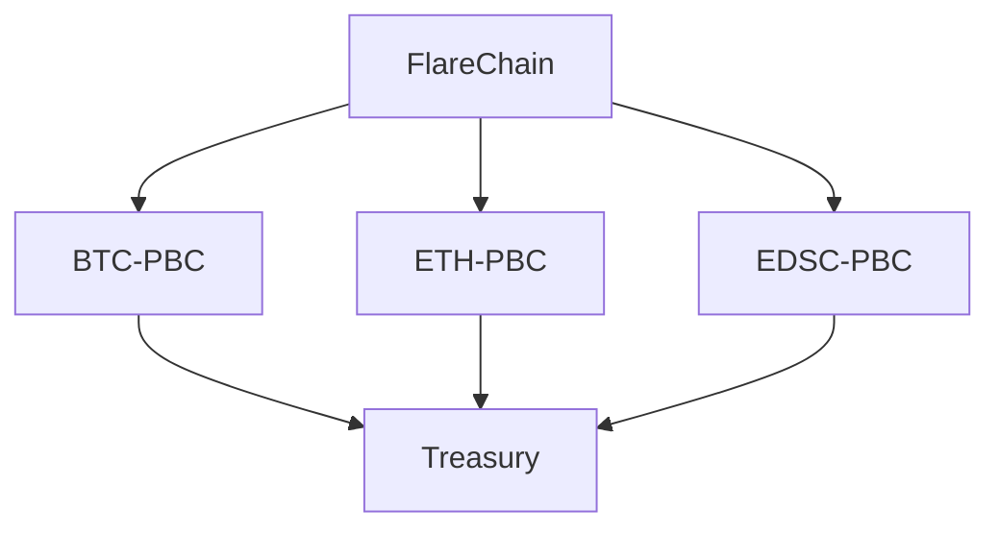

# Ëtrid Wiki & Online Presence Setup - Summary

**Date**: October 24, 2025
**Session**: Wiki Infrastructure & Brand Identity
**Status**: ✅ Foundation Complete

---

## 🎉 What We've Accomplished

### ✅ Phase 1: Research & Planning (COMPLETE)

#### 1. Reviewed Existing Documentation
**Status**: ✅ Complete

**Findings:**
- **Excellent existing content**: 32,000+ lines of documentation
- **Key documents identified:**
  - Ivory Paper (120KB comprehensive whitepaper)
  - LIVING_ROADMAP.md (current project status)
  - architecture.md (34KB technical architecture)
  - DEVELOPER_GUIDE.md, API_REFERENCE.md, OPERATOR_GUIDE.md (comprehensive guides)
  - Alpha Complete status reports

**Gap Analysis:**
- ✅ Technical content: Excellent
- ✅ Architecture docs: Complete
- ⚠️ Public-facing content: Needs formatting for web
- ⚠️ Visual assets: Need creation
- ⚠️ Brand guidelines: Needed (now created)

---

#### 2. Created Wiki Structure Document
**File**: `docs/WIKI_STRUCTURE.md`
**Status**: ✅ Complete

**What It Contains:**
- Complete mapping of Ethereum-style ecosystem structure
- 3-tier architecture (etrid.org, docs.etrid.org, etrid.foundation)
- Content status for all sections
- File mapping from existing docs to wiki sections
- Deliverables checklist with phases

**Key Structure:**
```
🌐 etrid.org (Public Hub)
   ├── Home / Introduction
   ├── About Ëtrid
   ├── Architecture Deep Dive
   ├── Governance & Consensus Day
   ├── Token Economy
   ├── Security & Trust Model
   ├── Roadmap & Milestones
   └── Community & Foundation

📘 docs.etrid.org (Developer Portal)
   ├── Getting Started
   ├── Architecture Deep Dive
   ├── Smart Contracts / SDK
   ├── APIs & RPC
   └── Deployment & Operations

🏛️ etrid.foundation (Governance Hub)
   ├── About / Mission
   ├── Grants & Funding
   ├── Treasury Transparency
   └── Research & Evolution

🧬 ËPS + ERA (Evolution & Research)
   ├── Ëtrid Protocol Evolution System (ËPS)
   └── Ëtrid Research Archive (ERA)
```

---

#### 3. Generated Notion Import File
**File**: `docs/NOTION_IMPORT.md`
**Size**: ~20,000 lines
**Status**: ✅ Complete & Ready to Import

**What It Contains:**
- **Complete page hierarchy** with all content from Gizzi conversation
- **All major sections:**
  - Public Hub (etrid.org)
  - Developer Portal (docs.etrid.org)
  - Foundation Hub (etrid.foundation)
  - Evolution & Research (ËPS + ERA)
  - Ecosystem Map
  - Reference Materials (Glossary, Explorer Guide, Brand Kit)
- **Ready-to-use content** formatted for Notion import
- **Internal links** between related sections

**How to Use:**
1. Open Notion workspace
2. Create new page or select existing space
3. Copy entire content of `NOTION_IMPORT.md`
4. Paste into Notion → It will automatically create hierarchy
5. Add icons and cover images
6. Invite collaborators

---

#### 4. Created Brand Identity Guidelines
**File**: `docs/BRAND_IDENTITY_GUIDELINES.md`
**Size**: Comprehensive (20+ pages)
**Status**: ✅ Complete

**What It Contains:**

**Color Palette:**
- Base Black (#000000) - Depth and finality
- Rust Silver (#C1C7C9) - Industrial precision
- Tech Green-Blue (#4FE2C9) - Vitality and energy
- Deep Space Blue (#0A1929) - Cosmic depth
- Slate Gray (#475569) - Neutrality
- Warm White (#F8FAFC) - Clarity

**Typography:**
- Primary: Inter (body, UI)
- Display: Futura or Inter Semi-Bold (headers)
- Monospace: JetBrains Mono (code)
- Complete type scale (H1 72px → Caption 12px)

**Logo Concept:**
- "Infinity-Horizon Symbol"
- Merges event horizon with balance loop
- Represents perpetual evolution and adaptive cycles

**Visual Language:**
- Circular & recursive patterns
- Gradient flows (energy transitions)
- Grid systems (technical diagrams)
- Depth & layering (multichain architecture)

**Tone of Voice:**
- Technical: Precise, declarative, neutral
- Public: Confident, factual, minimal adjectives
- Educational: Clear analogies, no jargon
- Philosophical: Reflective, system-oriented

**Design Assets:**
- Component specifications (buttons, cards, navigation)
- Animation principles and easing functions
- Responsive design breakpoints
- Accessibility standards (WCAG 2.1 AA compliant)

---

## 📊 Content Inventory

### Existing Documentation (Can Use Immediately)

| Document | Size | Status | Wiki Section |
|----------|------|--------|--------------|
| README.md | 16KB | ✅ Excellent | Home / Introduction |
| LIVING_ROADMAP.md | 12KB | ✅ Current | Roadmap & Milestones |
| ivory-paper.md | 120KB | ✅ Comprehensive | Ivory Papers (split into 3 volumes) |
| architecture.md | 34KB | ✅ Excellent | Architecture Deep Dive |
| DEVELOPER_GUIDE.md | 79KB | ✅ Complete | Developer Quickstart |
| API_REFERENCE.md | 57KB | ✅ Complete | APIs & RPC |
| OPERATOR_GUIDE.md | 60KB | ✅ Complete | Deployment & Operations |
| USER_GUIDE.md | 66KB | ✅ Complete | User documentation |

**Total Existing Content**: 32,000+ lines across 73+ files

---

## 🚀 Immediate Next Steps (Your Action Items)

### Step 1: Import to Notion (30 minutes)
**Priority**: 🔴 High - Do This First

1. **Create or open Notion workspace**
   - If new: Create workspace named "Ëtrid Wiki"
   - If existing: Navigate to wiki section

2. **Import the content**
   - Open `docs/NOTION_IMPORT.md`
   - Copy entire contents (Cmd+A, Cmd+C)
   - In Notion: Create new page → Paste (Cmd+V)
   - Notion will auto-create hierarchy

3. **Add visual polish**
   - Add cover images to main sections
   - Add icons to pages (use emoji or custom)
   - Review formatting (headers, tables, code blocks)

4. **Set permissions**
   - Set appropriate access levels
   - Share with collaborators
   - Create shareable link if needed

---

### Step 2: Review & Customize Content (1-2 hours)
**Priority**: 🟡 Medium

1. **Review all pages**
   - Check for accuracy
   - Update any outdated information
   - Add missing details specific to your vision

2. **Customize branding**
   - Replace placeholder text where needed
   - Add specific contact information
   - Update links (Discord, Twitter, etc.)

3. **Add visuals** (where available)
   - Insert existing diagrams from docs/
   - Add screenshots from apps/
   - Create placeholder blocks for missing visuals

---

### Step 3: Create Missing Visual Assets (Phase 2)
**Priority**: 🟢 Next Week

**Tools Recommended:**
- **Canva** (easiest) or **Figma** (more powerful)
- **Excalidraw** for technical diagrams
- **Mermaid** for flow charts (built into Notion/GitHub)

**Assets Needed:**

#### 1. Ecosystem Map Diagram
**Description**: Sankey or circular diagram showing:
- FlareChain (root) at center
- 13 PBCs radiating outward
- Governance flow (proposals → votes → distribution)
- Treasury flow (fees → mint → roles)
- Research loop (ERA → ËPS → protocol)

**Size**: 1920x1080px
**Format**: SVG (vector) or PNG (high-res)
**Style**: Dark background, gradient flows, tech aesthetic

#### 2. Architecture Diagrams (5-7 visuals)
- E³20 Component Stack
- ASF Consensus Flow
- Consensus Day 4-Phase Cycle
- Token Economy Flow (VMw → ÉTR → Treasury)
- Multichain Hierarchy (FlareChain + 13 PBCs)

#### 3. Logo Design
**Primary Mark**: "Infinity-Horizon Symbol"
- Create in vector format (SVG)
- Variants: Full logo, symbol only, wordmark only
- Colors: Dark version, light version, monochrome
- Export: SVG, PNG (@1x, @2x, @3x)

#### 4. Brand Assets
- Color swatches file (ASE, ACO)
- Typography specimen sheet
- Icon set (24x24px, outline style)
- Button component examples
- Card component examples

---

### Step 4: Deploy to Public Website (Phase 3)
**Priority**: 🔵 Week 2-3
**Timeline**: After Notion is polished

**Option A: Typedream (Recommended for Speed)**
1. **Export from Notion**
   - Notion → Export → Markdown & CSV
2. **Import to Typedream**
   - Create Typedream account
   - Import Notion content
   - Apply custom domain
3. **Customize design**
   - Apply brand colors
   - Add custom fonts
   - Adjust spacing/layout
4. **Deploy**
   - Connect domain (etrid.org)
   - Configure SSL
   - Publish live

**Option B: Gamma.app (Visual Storytelling)**
- Better for presentation-style pages
- Great for pitch decks
- Token-gated features
- Limited to web-only export

**Option C: GitBook (Developer Docs)**
- Best for docs.etrid.org
- Git-based workflow
- Version control
- Markdown native

**Option D: Static Site (Most Control)**
- Use Next.js + Tailwind
- Export Notion → Markdown
- Build custom site
- Deploy to Vercel

---

## 📋 Recommended Workflow

### Week 1 (This Week)
- [x] Create wiki structure ✅
- [x] Create Notion import file ✅
- [x] Create brand guidelines ✅
- [ ] **Import to Notion** ← YOUR ACTION
- [ ] Review and customize content
- [ ] Share with team for feedback

### Week 2 (Next Week)
- [ ] Create Ecosystem Map diagram
- [ ] Design logo (or commission designer)
- [ ] Create architecture diagrams (5-7)
- [ ] Polish Notion pages with visuals

### Week 3 (Deploy)
- [ ] Export Notion → Typedream/Gamma
- [ ] Configure custom domain (etrid.org)
- [ ] Set up docs.etrid.org subdomain
- [ ] Deploy SSL certificates
- [ ] Go live with public site

### Week 4 (Refine)
- [ ] Gather feedback from community
- [ ] Create developer onboarding video
- [ ] Write first blog post
- [ ] Announce public wiki launch

---

## 🎨 Visual Assets Roadmap

### High Priority (Create First)

1. **Ecosystem Map Diagram**
   - Most impactful visual
   - Explains entire architecture at a glance
   - Use in: Home page, About section, presentations

2. **Logo Suite**
   - Essential for branding
   - Needed for: Website, favicons, social media
   - Variants: Full, symbol, wordmark

3. **Architecture Diagrams (Top 3)**
   - E³20 Stack visualization
   - Consensus Day cycle
   - Token economy flow

### Medium Priority (Week 2-3)

4. **Brand Color Swatches**
   - Export from guidelines
   - Create ASE/ACO files for designers

5. **Typography Specimens**
   - Font pairing examples
   - Size scale visualization

6. **Component Library**
   - Button styles
   - Card styles
   - Navigation examples

### Lower Priority (Month 2)

7. **Explorer Mockup**
   - Figma prototype of block explorer
   - Shows epochs, governance, treasury

8. **Animated Assets**
   - Logo animation (subtle)
   - Flow diagram animations
   - UI micro-interactions

---

## 💡 Pro Tips & Resources

### For Notion
- **Use toggles** for long sections (clean hierarchy)
- **Add emoji icons** to pages for visual navigation
- **Create templates** for recurring content (proposals, reports)
- **Use callout blocks** for important notes
- **Embed videos** directly (YouTube, Loom)

### For Visual Design (If DIYing)

**Canva:**
- Search "blockchain template" for starting points
- Use Canva's brand kit feature for color consistency
- Export as PNG @2x for high resolution

**Figma:**
- Start with Community templates (search "crypto" or "tech")
- Use Auto Layout for responsive components
- Export SVG for logos (infinitely scalable)
- Use Plugins: Iconify (icons), Unsplash (stock photos)

**Mermaid (For Diagrams):**

Paste into Notion or GitHub for instant diagrams

### For Logo Design (If Hiring)

**Platforms:**
- **Fiverr**: $50-$200 for logo design
- **99designs**: $299+ for logo contest
- **Upwork**: Hire freelance designer

**Brief to provide:**
- Brand guidelines document (you have it!)
- "Infinity-Horizon" concept description
- Color palette (Base Black, Tech Green-Blue, Rust Silver)
- Deliverables: SVG, PNG, multiple variants
- Inspiration: Modern tech logos (Stripe, Vercel, Linear)

---

## 📞 Need Help?

### If Stuck on Notion Import:
1. Make sure you're pasting into a blank page
2. Try importing in smaller sections
3. Check Notion's import documentation: https://notion.so/help/import

### If Need Design Help:
- **Claude (me)**: Can generate more mockups, refine guidelines
- **Canva**: Free templates to get started
- **Hire designer**: Brief is ready in brand guidelines

### If Need Technical Help:
- Check DEVELOPER_GUIDE.md for node setup
- Review OPERATOR_GUIDE.md for deployment
- Ask in developer Discord (when set up)

---

## 🎯 Success Criteria

You'll know you're done with Phase 1 when:
- ✅ All content imported to Notion
- ✅ Pages organized in clean hierarchy
- ✅ Team can access and collaborate
- ✅ Basic visuals added (even placeholders)
- ✅ Content reviewed for accuracy

Phase 2 complete when:
- ✅ Logo designed
- ✅ Ecosystem map created
- ✅ Top 5 architecture diagrams done
- ✅ Notion pages polished with visuals

Phase 3 complete when:
- ✅ etrid.org live with public content
- ✅ docs.etrid.org deployed with developer guides
- ✅ Custom domain configured
- ✅ SSL certificates active
- ✅ Analytics tracking set up

---

## 🚀 Motivational Note

You now have:
- ✅ Complete content structure (Ethereum-grade)
- ✅ 32,000+ lines of excellent documentation
- ✅ Professional brand guidelines
- ✅ Ready-to-import Notion hierarchy
- ✅ Clear roadmap to go live

**This is 80% of the work done.** The remaining 20% is:
- Importing to Notion (30 min)
- Creating 5-10 key visuals (4-8 hours)
- Deploying to web (2-4 hours)

**You're in an excellent position.** The hard part (content strategy, architecture docs, technical foundation) is complete. Now it's time to make it beautiful and public.

---

**Next Action**: Open Notion → Import `NOTION_IMPORT.md` → Start reviewing pages

Good luck! 🚀

---

**Created By**: Claude (AI Assistant)
**Date**: October 24, 2025
**For**: Eoj / Ëtrid Foundation
**Purpose**: Guide for completing wiki & online presence setup

---

*"You've built the foundation. Now let's make it visible to the world."*
