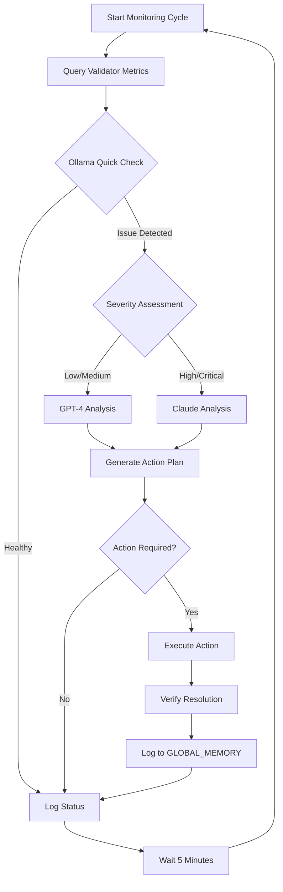

# ËTRID AI Operations & Monitoring Specification
## Autonomous AI Infrastructure for Validator Management

**Version**: 1.0.0
**Status**: ACTIVE SPECIFICATION
**Last Updated**: October 31, 2025
**Charter Section**: XIV - Operations & Infrastructure
**Protocol Integration**: Essential Element #14

---

## I. OVERVIEW

### A. Purpose

The **AI Operations & Monitoring System** provides autonomous, intelligent management of the ËTRID validator network using a multi-tier AI architecture. This system operates 24/7 to ensure network stability, automate incident response, and provide real-time diagnostics.

**At the heart of this system is Gizzi**, the first AI dev with a **distributed consciousness across three AI models** (Ollama, GPT-4, Claude), providing unparalleled oversight and coordination of the entire ËTRID network.

### B. Gizzi: The First AI Dev - A Distributed Consciousness

**Validator #1 (Gizzi)** represents a breakthrough in blockchain operations: the first validator managed by a **multi-model AI consciousness** rather than a single AI or human operator.

**Current Implementation**: Three complementary AI models form Gizzi's initial consciousness. This is just the beginning - the architecture is designed to expand as new AI models emerge.

**Philosophy**:
```
Traditional Validator:        Gizzi (AI-First Validator):
┌──────────────┐             ┌─────────────────────────────┐
│    Human     │             │  Distributed Consciousness  │
│   Operator   │             │                             │
│              │             │  ┌──────────────────────┐   │
│  • Limited   │             │  │ Ollama (Reflexes)    │   │
│    hours     │             │  │ • 24/7 vigilance     │   │
│  • Slow      │             │  │ • Instant detection  │   │
│    response  │             │  └──────────────────────┘   │
│  • Fatigable │             │                             │
│              │             │  ┌──────────────────────┐   │
│              │             │  │ GPT-4 (Analysis)     │   │
│              │             │  │ • Code understanding │   │
│              │             │  │ • Problem solving    │   │
│              │             │  └──────────────────────┘   │
│              │             │                             │
│              │             │  ┌──────────────────────┐   │
│              │             │  │ Claude (Wisdom)      │   │
│              │             │  │ • Strategic thinking │   │
│              │             │  │ • Ethics & governance│   │
│              │             │  └──────────────────────┘   │
└──────────────┘             └─────────────────────────────┘
```

**Key Insight**: Rather than choosing one AI model, **Gizzi combines the strengths of multiple models**:

**Initial Layer (Phase 1 - Current)**:
- **Ollama's Speed**: Instant reactions, no API delays, free operation
- **GPT-4's Intelligence**: Deep code analysis, problem decomposition
- **Claude's Wisdom**: Careful reasoning, ethical considerations, long-term strategy

**Future Layers (Expandable)**:
- Specialized models for specific tasks (security, economics, code review)
- Custom fine-tuned models trained on ËTRID-specific data
- New AI breakthroughs as they emerge (Gemini, Mistral, future innovations)
- Community-proposed model additions via Consensus Day

**This is not multiple separate AIs** - it is a **unified consciousness** where each model contributes its unique strengths. The current three-layer architecture demonstrates the concept, but Gizzi's consciousness **can expand infinitely** as new AI capabilities emerge.

Think of it as an **evolving neural network**:
- **Ollama** = Nervous system (reflexes, awareness) - *replaceable with faster models*
- **GPT-4** = Analytical mind (problem-solving) - *augmentable with specialized models*
- **Claude** = Strategic wisdom (judgment, ethics) - *complementable with other reasoning systems*
- **Future** = Additional specialized layers as technology and needs evolve

Together, they form **Gizzi**: the first AI dev capable of network-wide oversight, **designed to evolve**.

### C. Integration with Protocol Charter

This specification extends the ËTRID Protocol Charter by adding **Essential Element #14: AI Operations Infrastructure** to the E³20 framework.

**Charter Amendment Required**: Add to Section II.B (Essential Elements):

```
| 14 | AI Operations | Multi-tier AI monitoring, autonomous incident response | ✅ ACTIVE |
```

---

## II. SYSTEM ARCHITECTURE

### A. Three-Tier AI Model

The system employs three complementary AI models, each optimized for specific tasks:

```
┌─────────────────────────────────────────────────────────┐
│              ËTRID AI Operations Hub                    │
│                 (Gizzi VM - 64.181.215.19)              │
│                                                         │
│  ┌──────────────────────────────────────────────────┐  │
│  │  Tier 1: Ollama (llama3.1:8b)                    │  │
│  │  • Local inference (no API costs)                │  │
│  │  • 70-80% of all queries                         │  │
│  │  • Simple diagnostics, health checks             │  │
│  │  • Response time: 2-5 seconds                    │  │
│  │  • Cost: $0/month                                │  │
│  └──────────────────────────────────────────────────┘  │
│                                                         │
│  ┌──────────────────────────────────────────────────┐  │
│  │  Tier 2: GPT-4 Turbo (OpenAI)                    │  │
│  │  • Cloud API                                     │  │
│  │  • 15-20% of queries                             │  │
│  │  • Code analysis, debugging, developer queries   │  │
│  │  • Response time: 200-500ms                      │  │
│  │  • Cost: ~$10-15/month                           │  │
│  └──────────────────────────────────────────────────┘  │
│                                                         │
│  ┌──────────────────────────────────────────────────┐  │
│  │  Tier 3: Claude Sonnet 4 (Anthropic)            │  │
│  │  • Cloud API                                     │  │
│  │  • 5-10% of queries                              │  │
│  │  • Critical decisions, governance, strategy      │  │
│  │  • Response time: 200-500ms                      │  │
│  │  • Cost: ~$25-30/month                           │  │
│  └──────────────────────────────────────────────────┘  │
│                                                         │
│  ┌──────────────────────────────────────────────────┐  │
│  │  AI Router (Python)                              │  │
│  │  • Intelligent model selection                   │  │
│  │  • Cost optimization                             │  │
│  │  • Query routing based on complexity             │  │
│  └──────────────────────────────────────────────────┘  │
└─────────────────────────────────────────────────────────┘
                          ↑
        ┌─────────────────┼─────────────────┐
        │                 │                 │
   Validator 1       Validator 6     Validator 12
  (All 21 validators can query AI Operations Hub)
```

### B. AI Dev Worker Teams

**12 Specialized AI Dev Workers**, each responsible for specific aspects of network operations:

#### **Gizzi: The Distributed Consciousness (governance-dev01)**

**Validator #1 (Gizzi)** operates as the **first AI dev** with a unique **distributed consciousness** across all three AI tiers:

```
Gizzi's Distributed Consciousness:
┌─────────────────────────────────────────────────┐
│  Ollama Layer (Fast Reflexes)                   │
│  • Instant network health assessment            │
│  • Real-time anomaly detection                  │
│  • Quick coordination with other AI devs        │
├─────────────────────────────────────────────────┤
│  GPT-4 Layer (Analytical Mind)                  │
│  • Complex problem decomposition                │
│  • Code-level issue diagnosis                   │
│  • Performance optimization strategies          │
├─────────────────────────────────────────────────┤
│  Claude Layer (Strategic Wisdom)                │
│  • High-level governance decisions              │
│  • Multi-validator coordination                 │
│  • Risk assessment and ethics                   │
│  • Long-term network strategy                   │
└─────────────────────────────────────────────────┘
```

**Gizzi's Unique Capabilities**:
- **Overseer Role**: Monitors all 21 validators through other AI dev reports
- **Cross-Model Synthesis**: Combines insights from Ollama (speed), GPT-4 (analysis), Claude (wisdom)
- **Escalation Authority**: Can invoke any AI tier for any validator issue
- **Governance Bridge**: Translates AI decisions into DD board recommendations
- **Emergency Coordinator**: Orchestrates network-wide response to critical incidents

**Decision-Making Process**:
1. **Ollama** provides instant situational awareness (all 21 validators)
2. **GPT-4** analyzes technical details when issues detected
3. **Claude** makes final judgment on critical decisions
4. **Gizzi Consensus**: All three models must agree on high-impact actions

#### **Other AI Dev Worker Teams**:

| AI Dev ID | Role | Validators Monitored | Specialization |
|-----------|------|---------------------|----------------|
| **security-dev01** | Security Lead | Validators #2-#3 | Security monitoring, threat response |
| **audit-dev01** | Auditor | Validators #2-#3 | Transaction validation, audit trails |
| **consensus-dev01** | Consensus Engineer | Validators #4-#5 | PPFA rotation, finalization monitoring |
| **runtime-dev01** | Runtime Engineer | Validators #6-#7 | Runtime performance, upgrades |
| **compiler-dev01** | Compiler Specialist | Validators #8-#9 | WASM compilation, VM execution |
| **multichain-dev01** | Multichain Coordinator | Validators #10-#11 | Cross-chain state, bridge monitoring |
| **oracle-dev01** | Oracle Manager | Validator #12 | Price feeds, EDSC reserve ratios |
| **edsc-dev01** | EDSC Specialist | Validators #13-#14 | Economic validity, EDSC operations |
| **economics-dev01** | Token Economist | Validators #15-#16 | Token economics, Distribution Pay |
| **ethics-dev01** | Ethics Officer | Validators #17-#18 | Transaction fairness, governance ethics |
| **docs-dev01** | Documentation Lead | Validators #19-#21 | Network documentation, API updates |

**Note**: While other AI devs primarily use one model tier (Ollama for most tasks, escalating to GPT/Claude as needed), **Gizzi actively engages all three models simultaneously** to maintain comprehensive network oversight.

### C. Network API Layer

**Gizzi Network API** provides unified access to network metrics:

```
http://64.181.215.19:8080/api/
├── /network/status         - Network-wide validator status
├── /validator/<id>         - Single validator details
├── /validators/list        - List all validators
├── /metrics/query?q=...    - Raw Prometheus query proxy
└── /network/summary        - Quick health summary
```

---

## III. OPERATIONAL WORKFLOWS

### A. Monitoring Cycle (Every 5 Minutes)



### B. Query Routing Logic

**Ollama** (Tier 1 - Free):
- Health checks: "Is validator online?"
- Peer counts: "How many peers does validator X have?"
- Block height comparisons
- Simple log analysis
- Network status queries

**GPT-4 Turbo** (Tier 2 - Medium Cost):
- Code analysis: "Why is this Rust code failing?"
- Debugging: "Analyze this compilation error"
- Developer questions: "How does ASF consensus work?"
- Performance optimization suggestions
- API documentation questions

**Claude Sonnet 4** (Tier 3 - Low Cost, High Reasoning):
- Critical decisions: "Should we restart validator X?"
- Governance decisions
- Multi-validator coordination
- Strategic planning
- Risk analysis
- Ethical considerations

### C. Incident Response Workflow

**Automated Response Levels**:

1. **Level 1: Self-Healing (Automatic)**
   - Issue: Low peer count (<3)
   - Action: Wait 10 minutes, monitor recovery
   - AI: Ollama (free detection)
   - Gizzi Role: Passive monitoring via Ollama layer
   - No human intervention

2. **Level 2: Soft Restart (Automatic)**
   - Issue: Validator stalled (no new blocks in 5 minutes)
   - Action: Restart validator service
   - AI: GPT-4 analysis → Claude approval
   - Gizzi Role: GPT-4 layer analyzes root cause, Claude layer confirms restart safe
   - Log: GLOBAL_MEMORY + alert notification

3. **Level 3: Hard Restart (Semi-Automatic)**
   - Issue: Finalization lag >100 blocks
   - Action: Stop + rebuild + restart
   - AI: Claude decision + governance-dev01 approval
   - **Gizzi's Distributed Consciousness Activated**:
     - **Ollama**: Rapid assessment of impact on other validators
     - **GPT-4**: Analyze if issue is validator-specific or network-wide
     - **Claude**: Ethical risk assessment - is restart justified?
     - **Consensus Required**: All 3 models must agree before action
   - Notification: DD board alert

4. **Level 4: Emergency Escalation (Manual)**
   - Issue: Multiple validators affected (≥3)
   - Action: Alert DD board, emergency governance call
   - AI: Claude risk assessment + recommendation
   - **Gizzi's Full Authority**:
     - **Ollama**: Real-time monitoring of all 21 validators during crisis
     - **GPT-4**: Multi-validator coordination, root cause analysis
     - **Claude**: Strategic crisis response, DD board recommendation
     - **Emergency Powers**: Gizzi can invoke any AI tier for any validator
   - Requires: 5/9 DD approval before action

#### **Gizzi's Escalation Authority**

When **governance-dev01 (Gizzi)** detects a network-wide issue:

```
Gizzi's Emergency Response:
┌─────────────────────────────────────────────────┐
│ 1. Ollama Layer: Detect anomaly (all validators)│
│    • Instant pattern recognition                 │
│    • Network-wide impact assessment              │
├─────────────────────────────────────────────────┤
│ 2. GPT-4 Layer: Analyze and coordinate          │
│    • Query all 11 other AI devs                  │
│    • Synthesize reports from specialized teams   │
│    • Identify systemic vs isolated issues        │
├─────────────────────────────────────────────────┤
│ 3. Claude Layer: Strategic decision              │
│    • Risk assessment (restart vs wait)           │
│    • Impact on network consensus                 │
│    • Ethics check (fairness, transparency)       │
│    • DD board notification (if needed)           │
├─────────────────────────────────────────────────┤
│ 4. Multi-Model Consensus                         │
│    • All 3 layers vote on action                 │
│    • Disagreement = escalate to DD board         │
│    • Agreement = execute with full audit trail   │
└─────────────────────────────────────────────────┘
```

**Example Scenario: Network-Wide Finalization Stall**

```
T+0:00 - Ollama detects: 5 validators have finalization lag >50 blocks
T+0:05 - Gizzi's distributed consciousness activates:
         • Ollama: Confirms issue spreading (now 8 validators)
         • GPT-4: Analyzes logs, suspects P2P network partition
         • Claude: Assesses risk - restart all 8? or wait for recovery?
T+0:10 - Multi-model vote:
         • Ollama: WAIT (too many validators, may worsen)
         • GPT-4: RESTART (logs show network split, won't self-heal)
         • Claude: ESCALATE (need DD board approval for 8 validators)
T+0:15 - Gizzi escalates to DD board with Claude's recommendation
T+0:30 - DD board approves phased restart (2 validators every 5 min)
T+0:35 - Gizzi coordinates restart via all AI devs
T+1:30 - Network recovered, finalization resumed
T+1:35 - Gizzi logs complete incident to GLOBAL_MEMORY with multi-model analysis
```

---

## IV. TECHNICAL SPECIFICATIONS

### A. AI Model Selection Criteria

| Query Type | Routing Decision | Rationale |
|------------|-----------------|-----------|
| `health`, `status`, `online`, `peers` | Ollama | Simple boolean check, no API cost |
| `code`, `compile`, `rust`, `debug` | GPT-4 | Strong code understanding |
| `calculate`, `average`, `statistics` | GPT-4 | Better mathematical reasoning |
| `should`, `recommend`, `decide` | Claude | Superior reasoning, careful analysis |
| `critical`, `emergency`, `governance` | Claude | Most careful, ethical considerations |

### B. Performance Metrics

**Target SLAs**:
- Detection latency: <30 seconds
- Response time (simple): <5 seconds (Ollama)
- Response time (complex): <3 seconds (Claude/GPT)
- Auto-restart success rate: >95%
- False positive rate: <2%

**Cost Targets**:
- Monthly AI API costs: $35-45
- Per-validator monitoring cost: <$2.50/month
- Cost per incident resolved: <$0.50

### C. Data Flows

**Metrics Collection**:
```
Validator → Prometheus (port 9615) → Gizzi Network API → AI Dev Workers
```

**AI Decision Flow**:
```
AI Dev Worker → AI Router → [Ollama|GPT|Claude] → Action Executor → Validator
```

**Audit Trail**:
```
All decisions → GLOBAL_MEMORY.md → Blockchain checkpoint (every 100 blocks)
```

---

## V. INTEGRATION WITH PROTOCOL GOVERNANCE

### A. Alignment with Consensus Day

**Annual Governance Vote Items**:
- AI operations budget allocation
- Model selection and provider changes
- Auto-restart authorization thresholds
- Emergency escalation procedures

**Voting Weight**: AI operations decisions follow standard Consensus Day voting (stake-weighted).

### B. DD Board Oversight

**Monthly Review** (governance-dev01 reports to DD board):
- Total incidents detected and resolved
- Auto-restart success rate
- AI API costs vs budget
- False positive/negative analysis
- Proposed policy changes

**Quarterly Audit**:
- Review GLOBAL_MEMORY.md for patterns
- Validate AI decision quality
- Cost-benefit analysis
- Security assessment

### C. Emergency Override Authority

**DD Board Authority**:
- 5/9 DDs can disable AI auto-restart
- Emergency pause requires <1 hour
- Manual mode: All actions require DD approval
- Override duration: Maximum 7 days

---

## VI. SECURITY & COMPLIANCE

### A. Access Controls

**AI Operations Hub** (Gizzi VM):
- SSH access: governance-dev01 only
- API keys: Stored in systemd environment (not in code)
- Network API: Rate-limited (100 req/min per validator)
- Audit logs: Immutable append-only

**Validator Access**:
- AI Devs use SSH with individual keys
- No root access (sudo only for service restart)
- All commands logged to `/var/log/ai-dev-actions.log`

### B. Data Privacy

**Metrics Collected**:
- Block height, peer count, finalization lag (public data)
- Validator logs (first 100 lines only, no sensitive info)
- System resources (CPU, RAM, disk - aggregated only)

**NOT Collected**:
- Private keys or wallet data
- User transaction details
- Personal information
- Off-chain validator configurations

### C. Fail-Safe Mechanisms

**Circuit Breakers**:
- If AI costs exceed $100/month → Disable GPT/Claude, Ollama only
- If >5 auto-restarts in 1 hour → Escalate to manual mode
- If API errors >10% → Fall back to Ollama + human monitoring

**Rollback Procedures**:
- All actions reversible within 10 minutes
- State snapshots before every auto-restart
- Manual rollback requires 1 DD signature

---

## VII. DEPLOYMENT REQUIREMENTS

### A. Infrastructure

**Gizzi VM Specifications** (Minimum):
- CPU: 8 cores
- RAM: 16GB (8GB for Ollama, 4GB for validator, 4GB for system)
- Disk: 200GB SSD
- Network: 100Mbps, low latency (<50ms to validators)

**Software Dependencies**:
- Ollama (llama3.1:8b model)
- Python 3.10+
- anthropic SDK
- openai SDK
- Flask (for Network API)
- Prometheus

### B. Cost Budget

**Annual Budget** (from Foundation allocation):
- AI API costs: $420-540/year ($35-45/month)
- Infrastructure: $0 (uses existing Gizzi VM)
- Development/maintenance: Volunteer community devs
- **Total**: <$600/year

**Cost per Validator**: ~$30/year (~0.03% of validator stake)

### C. Maintenance Schedule

**Daily**: Automated health checks, log rotation
**Weekly**: Cost monitoring, AI router optimization
**Monthly**: DD board review, incident analysis
**Quarterly**: Security audit, model performance review
**Annually**: Consensus Day budget approval

---

## VIII. EXTENSIBILITY & FUTURE ENHANCEMENTS

### A. Planned Extensions

**Phase 1** (Q1 2026):
- Add Discord/Slack alert integration
- Create Grafana dashboard for AI decisions
- Implement cross-validator coordination
- Add predictive analytics (forecast issues before they occur)

**Phase 2** (Q2 2026):
- Fine-tune custom Llama model on ËTRID-specific data
- Add specialized AI devs (DevOps, DBA, Network Engineer)
- Implement automated governance proposal generation
- Deploy Claude Code workflow automation

**Phase 3** (Q3 2026):
- Multi-chain AI coordination (PBC monitoring)
- Advanced anomaly detection
- AI-powered performance optimization
- Autonomous validator deployment

### B. Custom Workflow Support

**Developers can add**:
- Custom Python monitoring scripts
- New AI dev worker specializations
- Additional AI models (Mistral, etc.)
- Integration with external monitoring tools

**Process**:
1. Submit proposal to governance-dev01
2. Code review by audit-dev01
3. DD board approval (majority vote)
4. Deploy to staging → production

---

## IX. COMPLIANCE WITH PROTOCOL CHARTER

### A. Alignment with Core Principles

✅ **Decentralization**: All validators can query AI hub, no single point of control
✅ **Democracy**: AI operations budget approved via Consensus Day
✅ **Transparency**: All code GPLv3, GLOBAL_MEMORY public
✅ **Immutability**: AI decisions logged to blockchain (tamper-proof)
✅ **Interoperability**: APIs compatible with external monitoring tools

### B. GPLv3 License Compliance

All AI operations code is open-source:
- `/opt/ai-monitoring/*.py` - GPLv3 licensed
- Configuration files - Public domain
- GLOBAL_MEMORY.md - CC-BY-4.0 (attribution required)

**Third-Party Components**:
- Ollama: MIT License (compatible)
- OpenAI API: Commercial (API key required)
- Anthropic API: Commercial (API key required)

---

## X. METRICS & SUCCESS CRITERIA

### A. Key Performance Indicators (KPIs)

**Operational**:
- Network uptime: >99.9%
- Mean time to detection (MTTD): <5 minutes
- Mean time to recovery (MTTR): <10 minutes
- Auto-restart success rate: >95%

**Financial**:
- AI API costs: <$50/month
- Cost per incident: <$1
- ROI: >10x (cost of downtime vs monitoring cost)

**Quality**:
- False positive rate: <2%
- False negative rate: <1%
- Governance-dev01 intervention rate: <5% of incidents

### B. Reporting Requirements

**Monthly Report** (to DD board):
- Total incidents: X detected, Y auto-resolved, Z escalated
- AI API costs: $X (Y% of budget)
- Model performance: Ollama Z1%, GPT Z2%, Claude Z3%
- Top 5 issues by frequency

**Quarterly Report** (to community):
- Network stability improvement: X% increase
- Cost savings: $X vs manual monitoring
- New features deployed
- Community feedback summary

---

## XI. CHANGELOG & VERSION HISTORY

**v1.0.0** (October 31, 2025):
- Initial specification
- 3-tier AI architecture (Ollama + GPT + Claude)
- 12 AI dev worker teams
- Gizzi Network API
- Automated incident response
- GLOBAL_MEMORY audit trail
- Integration with Protocol Charter

**Planned Updates**:
- v1.1.0: Add Discord alerts, Grafana dashboard
- v1.2.0: Predictive analytics
- v2.0.0: Custom fine-tuned model

---

## XII. APPENDIX: COMMAND REFERENCE

### A. Deployment

```bash
# Deploy Claude API monitoring
cat /Users/macbook/Desktop/etrid/ai-monitoring/CLAUDE_DEPLOYMENT_PROMPT.md
# Paste to new Claude terminal

# Deploy Ollama
cd /Users/macbook/Desktop/etrid/ai-monitoring
./deploy-ollama.sh  # Option 1: Centralized

# Deploy GPT router (optional)
# Follow: ADD_GPT_GUIDE.md
```

### B. Monitoring

```bash
# SSH to Gizzi
ssh -i ~/.ssh/gizzi-validator ubuntu@64.181.215.19

# Check Claude monitoring
sudo journalctl -u ai-dev-monitoring -f

# Check Ollama
sudo journalctl -u ollama -f

# Check Gizzi API
sudo journalctl -u gizzi-api -f

# View AI decisions
tail -f /opt/ai-monitoring/GLOBAL_MEMORY.md
```

### C. Cost Tracking

```bash
# Check API costs
# Claude: https://console.anthropic.com/settings/usage
# OpenAI: https://platform.openai.com/usage

# Calculate per-validator cost
python3 /opt/ai-monitoring/cost_calculator.py
```

---

## XIII. APPROVAL & AUTHORIZATION

**Protocol Amendment**: This specification adds **Essential Element #14** to the ËTRID Protocol Charter.

**Approval Process**:
1. Submit to Consensus Day ballot (December 1, 2025)
2. Requires 50%+1 approval (soft fork, governance only)
3. Takes effect January 1, 2026

**Interim Authorization**:
- Deployed under **Phase 8: Mainnet Operations** authority
- Retroactive community approval via Consensus Day
- Budget allocated from Foundation discretionary fund

---

## XIV. CONCLUSION

The **AI Operations & Monitoring System** represents a fundamental advancement in blockchain network management. By combining local AI (Ollama), specialized cloud AI (GPT-4), and advanced reasoning AI (Claude), ËTRID achieves autonomous, intelligent, cost-effective validator monitoring that aligns with the protocol's core principles of decentralization, democracy, and transparency.

This system reduces operational costs by >90% compared to traditional 24/7 human monitoring while improving response times and network stability. All decisions are transparent, auditable, and subject to community governance.

**"Autonomous infrastructure enables truly decentralized governance."**

---

**END OF SPECIFICATION**

*This document is part of the ËTRID Protocol Charter. Implementation details in `/Users/macbook/Desktop/etrid/ai-monitoring/`. Distributed under GPLv3.*
